# 🎨 Multimedia Programming Class Project

> **세종대학교 소프트웨어학과 · 2025년 1학기 멀티미디어 프로그래밍**
> 22011807 최재현
>
> C++ / OpenCV(IplImage) 만으로 OpenCV 내장 함수에 기대지 않고 영상처리·컴퓨터비전·그래픽스 알고리즘을 **직접 구현**한 6개 과제 모음입니다.
> 모든 알고리즘은 라이브러리 호출이 아닌 픽셀 단위 연산으로 작성했습니다.

<p align="center">
  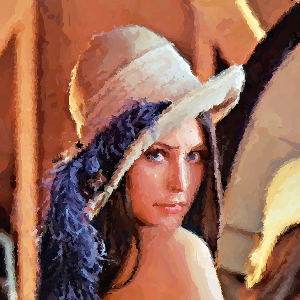
</p>

<p align="center">
  <em>Project 3 — Painterly Rendering : 이미지를 수채화 느낌으로 변환</em>
</p>

---

## 🗂️ 프로젝트 한눈에 보기

| #  | 프로젝트                          | 핵심 키워드                                              | 수업 개념                                  |
|----|-----------------------------------|---------------------------------------------------------|--------------------------------------------|
| 1  | A Colorful Russian Empire         | 채널 분리, **SSD 매칭**, 계층적 탐색, 오프셋 정렬       | 이미지 정합 / 유사도 측정                  |
| 2  | Fastest Mean Filter               | **Summed Area Table (SAT)**, O(1) 평균 필터             | 적분 영상 / 시간복잡도 최적화              |
| 3  | Painterly Rendering               | **다중 레이어 브러시**, Gaussian blur, **Gradient 기반 Spline Stroke** | 비사실적 렌더링(NPR) / 그래디언트         |
| 4  | Image Homography 3D Illusion      | **Homography 행렬**, 8×8 역행렬, 역방향 어파인, 큐브 모델/뷰/투영 | 동차좌표 / 투영변환 / 3D 파이프라인       |
| 5  | Texture Synthesis                 | **Non-parametric synthesis**, 마스크, 패치 SSD 비교     | 텍스처 합성 / 이웃 기반 매칭              |
| 6  | Metamorphosis (Beier–Neely)       | **라인 페어 워핑**, 가중치 보간, 쌍방향 모핑 + 크로스디졸브 | 기하 변형 + 색 보간                        |

---

## 🛠️ 기술 스택

<p align="center">
  
  
</p>

- **언어**: C++ (C-style OpenCV API: `IplImage`, `CvScalar`, `cvGet2D`/`cvSet2D`)
- **빌드**: Visual Studio 2019+ (`*.sln` / `*.vcxproj` 포함)
- **외부 의존**: OpenCV (이미지 IO·표시 용도, 알고리즘은 직접 작성)
- **수학 도구**: 동차좌표·역행렬·gradient·SAT·spline 모두 직접 구현

> ⚠️ `cvSmooth`, `cvCircle`, `cvLine` 등 **렌더링·간단한 입력 처리** 외의 모든 알고리즘은 라이브러리에 의존하지 않고 작성했습니다.

---

## 1️⃣ A Colorful Russian Empire — 3채널 정합 컬러라이제이션

<p align="center">
  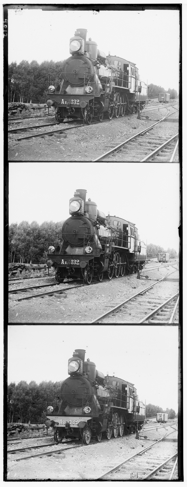
  &nbsp;&nbsp;
  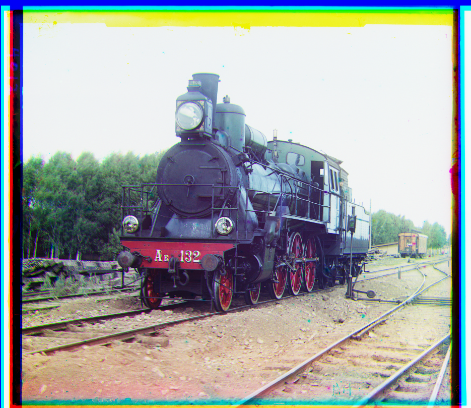
</p>
<p align="center">
  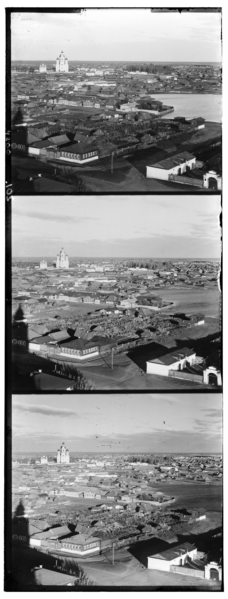
  &nbsp;&nbsp;
  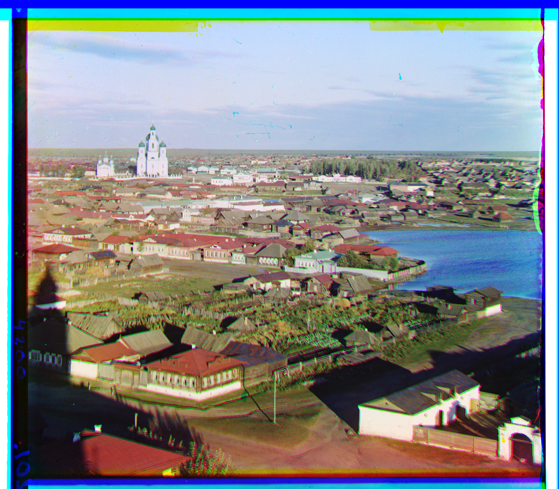
</p>

### 🎯 목표
세로로 3등분된 흑백 R/G/B 채널 사진(Prokudin-Gorskii 원판)을 **자동 정렬**하여 원본 컬러 사진을 복원한다.

### 🔧 구현 포인트
- `CutImage()` — 원본을 세로 3등분, `CombineRGB()` — 세 채널 합성
- `Match()` — 두 이미지 사이 **SSD(Sum of Squared Differences)** 최소가 되는 오프셋 (u, v) 탐색
- **계층적(coarse-to-fine) 탐색**: `area_jump=10` 간격 격자 탐색 → 최소값 주위에서 1 px 정밀 탐색
- 격자 프레임이 매칭을 방해하므로 SSD 계산 시 **테두리 `frame_size=80` px 제외**

### 🧪 시도한 방법 비교

| 방법                             | 정확도 | 속도        | 채택 여부 | 사유                                          |
|----------------------------------|:------:|:-----------:|:---------:|-----------------------------------------------|
| 전수 탐색 (모든 오프셋·모든 픽셀) | ★★★★★ | ★ (수십 초) | ❌        | 너무 느림                                     |
| **샘플링 + 계층적 탐색**         | ★★★★  | ★★★★★ (≈20× 빨라짐) | ✅ | 최종 채택                                    |
| SSD 조기 종료 (현재 최소값 초과시 break) | ★★ | ★★★★★ | ❌ | 픽셀 수가 달라 평균값 비교가 불공정해짐       |
| SSD 픽셀 차이 클램핑(max 1000)   | ★★★    | ★★★★★ | ❌        | 파란 하늘처럼 채널 간 정상 차이까지 무시      |
| **테두리 마스킹**                | ★★★★★ | ★★★★★ | ✅ | 격자 프레임만 정확히 제외 — 최종 채택        |

### 🐛 시행착오
> SSD 조기 종료(early-break)를 적용했더니 결과가 불안정했다. 점프 격자 탐색 시 영역마다 검사 픽셀 수가 달라 **합이 더 커도 평균은 더 작을 수** 있었기 때문 — 결국 폐기.

```cpp
// 격자 점프 → 정밀 탐색 (코드 발췌)
const int area_jump = 10;
for (int v = -area_size; v <= area_size; v += area_jump)
    for (int u = -area_size; u <= area_size; u += area_jump) {
        double s = getSSD(origin, move, u, v);
        if (s < min_ssd) { min_ssd = s; min_u = u; min_v = v; }
    }
// 찾은 (min_u, min_v) 주변 area_jump×area_jump 영역만 1 px 정밀 탐색
```

---

## 2️⃣ Fastest Mean Filter — SAT로 O(1) 평균 필터

<p align="center">
  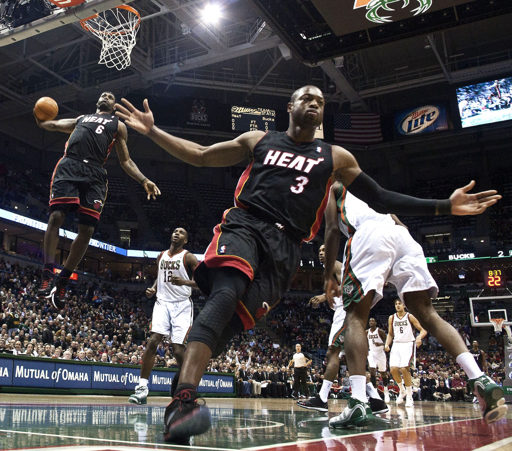
  &nbsp;&nbsp;
  
</p>

### 🎯 목표
커널 크기 *k* 가 아무리 커져도 **일정한 시간**에 동작하는 mean filter를 만든다.

### 🔧 구현 포인트
- **Summed Area Table (적분 영상)** 을 한 번만 미리 계산
  `sat[y][x] = sat[y-1][x] + sat[y][x-1] - sat[y-1][x-1] + img[y][x]`
- 임의 사각형의 합은 4번의 lookup만으로:
  `sum = D − B − C + A` → 평균 = `sum / (w·h)`
- `(x±k, y±k)` 코너를 이미지 경계에 클램프 → 경계 분기 없음, 코드 깔끔
- SAT는 동적 할당(`new CvScalar*[h]`)으로 임의 크기 입력 지원, 종료 시 정확히 해제

### ⏱️ 복잡도 비교

| 방식                | 시간복잡도 (픽셀당) | 전체           | 메모리             |
|---------------------|:-------------------:|:--------------:|:------------------:|
| 단순 평균 필터       | O(k²)              | O(W·H·k²)      | O(1)               |
| 분리형 1D 필터(누적합) | O(k)              | O(W·H·k)       | O(W) 또는 O(H)     |
| **SAT 기반 (채택)** | **O(1)**            | **O(W·H)**     | O(W·H) (1회 사전계산) |

### 🐛 시행착오
경계 픽셀 처리를 매번 `if`로 분기했더니 코드가 지저분해졌다. **꼭짓점 4개를 미리 클램프**하는 방식으로 바꿔 분기를 제거했다.

```cpp
int corner_u = max(0, y - k - 1);
int corner_l = max(0, x - k - 1);
int corner_r = min(src->width  - 1, x + k);
int corner_d = min(src->height - 1, y + k);
int count = (corner_d - corner_u) * (corner_r - corner_l);
double a = sat[corner_u][corner_l].val[i];
double b = sat[corner_u][corner_r].val[i];
double c = sat[corner_d][corner_l].val[i];
double d = sat[corner_d][corner_r].val[i];
f.val[i] = (d - b - c + a) / count;   // 단 4번 lookup
```

---

## 3️⃣ Painterly Rendering — 사진을 회화로

<p align="center">
  
  &nbsp;&nbsp;
  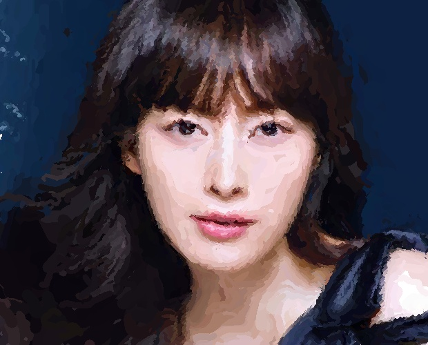
</p>
<p align="center">
  
  &nbsp;&nbsp;
  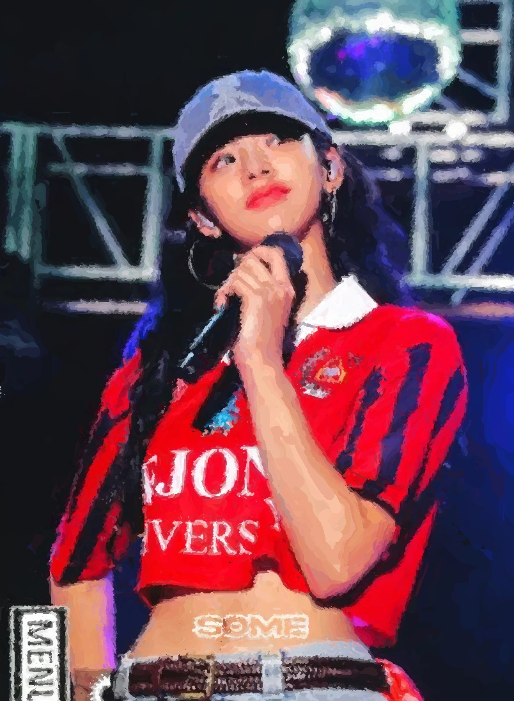
</p>

### 🎯 목표
사진을 **사람이 그린 유화처럼** 변환 — 큰 붓부터 작은 붓 순으로 레이어드 페인팅.

### 🔧 구현 포인트
- 레이어 5단계 (`brushSize = {30, 15, 7, 4, 2}`) — 큰 붓이 먼저, 점점 디테일을 더해가는 방식
- 각 레이어마다 원본을 **Gaussian blur** → 레퍼런스로 사용
- `PaintLayer()` — 격자 한 칸에서 캔버스와 레퍼런스의 차이가 가장 큰 점을 찾고, threshold 초과 시 그 점에 stroke 저장 → 무작위 순서로 그림
<p align="center">
  <table align="center">
    <tr>
      <td align="center"></td>
      <td align="center"></td>
    </tr>
    <tr>
      <td align="center"><em>Circle</em></td>
      <td align="center"><em>Stroke</em></td>
    </tr>
  </table>
</p>
- 두 가지 stroke 모드:
  - **CIRCLE** — 단순 원
  - **STROKE (LineBrush)** — `Brush`를 상속한 곡선 브러시
- **MakeSplineStroke**: 컬러 gradient의 **법선 방향**으로 따라가며 점을 추가 → 자연스러운 곡선 stroke

### 🎨 Stroke 알고리즘 비교

| 방식                       | 자연스러움 | 구현 난이도 | 비고                                  |
|----------------------------|:----------:|:-----------:|---------------------------------------|
| 원형 점 (CIRCLE)            | ★★         | ★           | 점묘화 같은 느낌                      |
| Gradient 무시 직선 stroke   | ★★★        | ★★          | 방향감은 있지만 경계를 가로지름        |
| **Gradient 법선 + 곡선**    | ★★★★★     | ★★★★        | 색 비슷한 곳을 따라 흐르는 자연스러운 붓터치 — 최종 채택 |

### 🐛 시행착오 3선

**① Gradient 방향이 항상 우하향으로 쏠림**
처음엔 색차를 *제곱합* 으로 계산했는데 항상 양수라 방향이 1사분면으로만 나왔다. **부호 있는 RGB 차이의 평균**으로 수정.

```cpp
// ❌ 항상 양수 → 방향이 (+,+) 사분면으로 고정
return sqrt((dx_b)*(dx_b) + (dx_g)*(dx_g) + (dx_r)*(dx_r));

// ✅ 부호 보존
inline float GetDiff2(CvScalar f, CvScalar g) {
    return (f.val[0] - g.val[0] + f.val[1] - g.val[1] + f.val[2] - g.val[2]) / 3.0f;
}
```

**② 두 법선 벡터 중 어느 쪽으로 갈지**
gradient의 법선은 두 방향. **이전 stroke 방향과의 내적이 음수**라면 180° 돌려서 진행 방향을 유지했다.

**③ 색이 균일한 영역에 stroke가 안 그려짐**
`spline.len == 1` 인 경우 선이 그려지지 않는 버그 → `len==1`이면 그 자리에 점을 찍도록 분기 추가.

```cpp
void Draw(IplImage* dst) override {
    if (len == 1) Brush::Draw(dst);     // 길이 1짜리 stroke은 점으로
    CvPoint prev = pos;
    for (int i = 1; i < len; i++) {
        cvLine(dst, prev, points[i], color, size);
        prev = points[i];
    }
}
```

추가로 **smoothing factor 0.9**(이전 방향 + 현재 방향 가중평균)로 급격한 꺾임도 완화했다.

---

## 4️⃣ Image Homography & 3D Illusion — 큐브 면 텍스처 매핑

<p align="center">
  
</p>

### 🎯 목표
3D 큐브의 6면이 회전하면서 화면 좌표에 **임의의 사각형**으로 보일 때, 그 4점에 맞춰 텍스처 이미지를 **homography**로 투영한다.

### 🔧 구현 포인트
- **3D 파이프라인**: `ModelMat × ViewMat × ProjMat`(Perspective + LookAt) 직접 구성, 큐브의 8 vertex / 6 face를 매 프레임 2D로 투영
- 각 면마다 **Homography** *H* 를 계산:
  - 4쌍의 (src ↔ dst) 점에서 8개의 선형 방정식 유도 → `M·h = b` (8×8 시스템)
  - `h33 = 1`로 정규화한 뒤 **8×8 역행렬** 직접 구현(`MatrixInverse.cpp`)으로 *h* 계산
- 이미지 손실 방지를 위해 **역방향 어파인 변환** (출력 좌표 → 원본 좌표 lookup)
- **back-face culling** — face의 normal로 보이지 않는 면은 그리지 않음

### 🧮 변환 방법 비교

| 방법                            | 정확도 | 일반성              | 채택 여부 |
|---------------------------------|:------:|:-------------------:|:---------:|
| Affine (3×3, scale/rotate/shear)| ★★     | 평행선만 보존        | ❌ — 원근 표현 불가 |
| **Homography (3×3, 8 DOF)**     | ★★★★★ | 임의 사각형 ↔ 사각형 | ✅ |
| Forward warping (src → dst)     | ★★     | hole/aliasing 발생  | ❌ |
| **Inverse warping (dst → src)** | ★★★★★ | 빈 픽셀 없음         | ✅ |

### 🐛 시행착오
**역행렬 함수가 계속 false를 반환** → 디버깅해보니 테스트 좌표 4점이 **공선(共線)** 이라 *M* 이 특이행렬이었다. 일직선·중복 없는 4점으로 바꾸자 해결.
또한 `h33=1` 정규화의 의미가 처음엔 와닿지 않아 자료를 찾아 공부 — homography는 9개 원소 중 8 DOF 라 한 자리를 정규화해도 무방.

```cpp
// 역방향 어파인 (각 dst 픽셀에 대해 src 좌표를 역추적)
float x1 = IM[0][0]*x2 + IM[0][1]*y2 + IM[0][2];
float y1 = IM[1][0]*x2 + IM[1][1]*y2 + IM[1][2];
float w1 = IM[2][0]*x2 + IM[2][1]*y2 + IM[2][2];
x1 /= w1; y1 /= w1;     // 동차좌표 정규화
```

---

## 5️⃣ Texture Synthesis — 비모수적 텍스처 합성

<p align="center">
  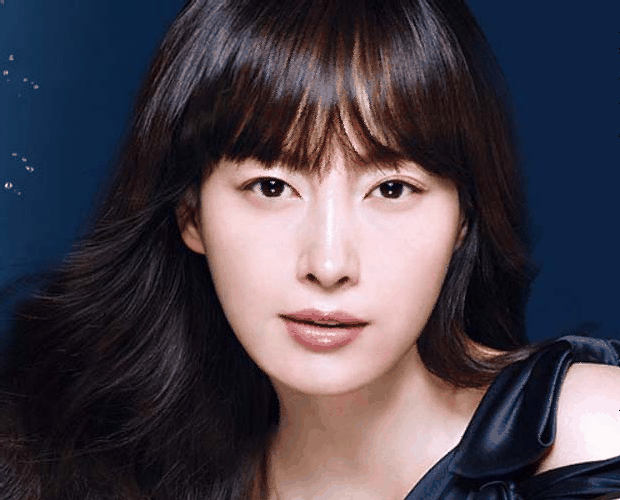
</p>

<p align="center">
  <em>오른쪽·아래 영역이 패치 매칭으로 점진적으로 합성되는 모습</em>
</p>

<p align="center">
  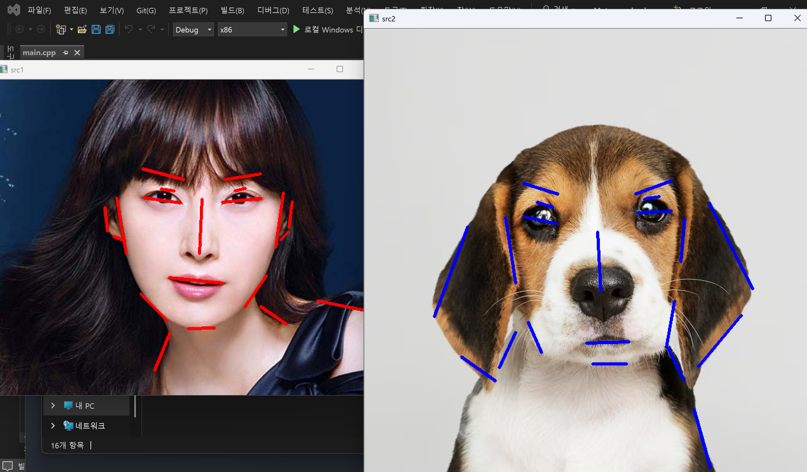
</p>

### 🎯 목표
작은 텍스처 샘플을 입력 받아, **두 배 크기**의 자연스러운 텍스처 이미지를 생성한다 (Efros–Leung 스타일의 비모수적 합성).

### 🔧 구현 포인트
- 결과 캔버스 좌상단에 **원본을 그대로 복사**, 나머지 영역은 한 픽셀씩 채워나감
- 채울 픽셀마다 그 주변 `(2K+1)×(2K+1)` (K=2) 패치를 비교 — 이미 채워진 픽셀만 비교 대상으로 삼는 **mask** 사용
- 원본의 **모든 위치** 와 SSD를 계산해 **best-match 색**을 가져옴 (`findBestMatchColor`)
- 마스크 기반 부분 패치 비교가 핵심 — 새 픽셀의 이웃 중 일부는 아직 비어있기 때문

### 📐 패치 비교 방식 비교

| 방식                                  | 결과 품질 | 속도 | 비고                                  |
|---------------------------------------|:---------:|:----:|---------------------------------------|
| 1픽셀 단위 색 평균 매칭                | ★         | ★★★★★ | 텍스처 구조 무너짐                    |
| 고정 크기 패치 + 마스크 무시          | ★★         | ★★★★ | 가장자리에서 깨짐                     |
| **(2K+1)² 패치 + 마스크 SSD (채택)** | ★★★★      | ★★   | 자연스러운 결합, 픽셀당 O(WH·K²)      |

### 🛠️ 핵심 코드

```cpp
// 마스크된 픽셀만 SSD 합산 → 평균
for (int v = -K; v <= K; v++)
  for (int u = -K; u <= K; u++) {
      int ttx = tx+u, tty = ty+v;
      if (ttx < 0 || ttx > dst->width-1)  continue;
      if (tty < 0 || tty > dst->height-1) continue;
      if (mask[tty][ttx] == 0) continue;       // 아직 안 채워진 자리는 skip
      err += diff2(cvGet2D(src, sy+v, sx+u),
                   cvGet2D(dst, tty, ttx));
      count++;
  }
return err / count;
```

### 🐛 시행착오
- `count==0`(완전히 마스크된 패치)으로 0-나누기가 발생하지 않도록, 이미 채워진 영역(원본 복사 부분)부터 시작해 항상 비교 대상이 존재하도록 **합성 순서**를 좌→우, 위→아래로 고정.
- 합성 진행 상황을 보려고 매 픽셀마다 `cvShowImage` + `cvWaitKey(1)` — 시각적 디버깅이 매우 효과적이었음 (위 GIF가 그 결과).

---

## 6️⃣ Metamorphosis — Beier–Neely 라인 기반 모핑

<p align="center">
  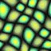
  &nbsp;&nbsp;
  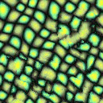
</p>

### 🎯 목표
두 이미지에 **대응 라인 쌍** 을 사용자가 그어두면, *t* 가 0 → 1로 변할 때 첫 이미지가 두 번째 이미지로 **부드럽게 변형** 된다.

### 🔧 구현 포인트
- **마우스 콜백** (`myMouse1`, `myMouse2`) 으로 두 이미지에 라인 쌍 (P, Q) 입력 → 스페이스바로 시작
- **Beier–Neely 알고리즘**:
  - 각 라인 (P, Q) 에 대해 픽셀 X의 라인 좌표계 *u* (라인 방향 비율), *v* (수직 거리) 계산
  - 변환된 좌표:
    `X' = P' + u·(Q' − P') + v·perp(Q' − P')/|Q' − P'|`
  - 여러 라인의 결과를 **거리 가중치** `w = (lineLen / (0.1 + dist²))^0.5` 로 가중평균
- 매 *t* 마다:
  1. 중간 라인 (1−t)·src1 + t·src2 계산
  2. **양쪽 이미지 각각** 을 그 중간 라인으로 워프 (`mid1`, `mid2`)
  3. **크로스 디졸브** — `(1−t)·mid1 + t·mid2` 로 합성

### ⚖️ 워핑 전략 비교

| 방식                         | 자연스러움 | 비고                                       |
|------------------------------|:---------:|--------------------------------------------|
| 한쪽만 워프 후 디졸브        | ★★         | 가장자리 ghosting                          |
| **양방향 워프 + 디졸브**     | ★★★★★     | 두 이미지 모두 중간 모양으로 맞춰져 자연스러움 — 채택 |
| 단일 라인만 사용              | ★         | 코나 입처럼 부분 특징이 일그러짐           |
| **다중 라인 + 거리 가중**     | ★★★★★     | 라인이 많을수록 정밀 — 채택               |

### 🛠️ 핵심 수식 → 코드

```cpp
// Beier–Neely: 라인 좌표계 (u, v)
float u = (PQx*PXx + PQy*PXy) / (lenPQ*lenPQ);
float v = (-PQy*PXx + PQx*PXy) / lenPQ;

// 대응 라인의 좌표계로 역사상
float x2 = P2.x + u*PQ2x + v*(-PQ2y)/lenPQ2;
float y2 = P2.y + u*PQ2y + v*( PQ2x)/lenPQ2;

// 라인까지 거리 dist에 따라 가중치
*pW = pow((lenPQ2 / (0.1 + dist*dist)), 0.5);
```

### 🐛 시행착오
- *u* 가 [0,1]을 벗어나면 **라인 끝점까지의 거리**로 dist 보정 — 라인 외부에서도 자연스러운 영향력 감쇠가 되도록.
- 한 이미지만 워프하고 디졸브했더니 ghosting이 심해서, 두 이미지를 모두 중간 모양으로 워프하는 **양방향 워프** 로 변경.

---

## 🛠️ 빌드 & 실행

### 요구사항
- Windows + Visual Studio 2019 이상
- OpenCV (3.x 이전, **C API: `IplImage`** 사용 가능 버전) — Visual Studio의 include/lib 경로에 등록 필요
- 입력 이미지는 기본적으로 `C:\Temp\` 에서 읽도록 작성됨 (각 `main.cpp` 상단에서 경로 변경 가능)

### 빌드
각 폴더의 `*.sln` 을 Visual Studio로 열고 **x64 / Release**로 빌드 → 실행.

```bash
# 예) 1번 과제
cd 1AColorfulRussianEmpire
# mp_hw2.sln 을 Visual Studio로 open → F5
```

### 입력
- 1, 2, 3번: 콘솔에 이미지 경로를 입력
- 4번: 키보드(아래 코드 참고)로 큐브 회전
- 6번: 두 창에서 마우스 드래그로 라인 쌍 입력 → **Space** 키로 모핑 시작

---

## 📚 직접 구현한 것들 (학습 정리)

> 라이브러리에 의존하지 않고 **알고리즘 자체** 를 작성하는 데 초점을 뒀습니다.

- ✅ **SSD 기반 영상 정합**과 coarse-to-fine 탐색 (Project 1)
- ✅ **Summed Area Table** 과 그것을 이용한 O(1) 평균 필터 (Project 2)
- ✅ **Gaussian-pyramid 풍의 다중 레이어 페인팅** (Project 3)
- ✅ **Gradient 기반 spline brush stroke** — 색을 따라 흐르는 곡선 (Project 3)
- ✅ **Homography 행렬 유도** (8 방정식 → 8×8 선형시스템) (Project 4)
- ✅ **임의 크기 행렬 역행렬** 함수 — Gauss-Jordan (Project 4)
- ✅ **3D 파이프라인** (Model / View / Projection / Perspective / LookAt) 직접 구성 (Project 4)
- ✅ **역방향 어파인 매핑** — hole-free warping (Project 4, 6)
- ✅ **비모수적 텍스처 합성** + 마스크된 패치 SSD (Project 5)
- ✅ **Beier–Neely 라인 기반 모핑** + 양방향 워프 + 크로스 디졸브 (Project 6)
- ✅ **마우스 인터랙션** 으로 라인 페어 입력 받는 GUI (Project 6)

### 🧠 가장 크게 배운 점
1. **시간복잡도 사고** — 같은 결과를 내더라도 SAT(O(1)) vs naive(O(k²)) 의 차이는 코드 한 줄이 아니라 **데이터 구조 선택** 이었다.
2. **부호 있는 차이 vs 제곱 차이** — gradient 처럼 *방향* 이 중요한 곳에서는 제곱합을 쓰면 정보가 사라진다.
3. **역방향 워핑** — 출력 픽셀에서 원본을 lookup하는 방식이 forward warping의 hole 문제를 깔끔히 해결한다.
4. **시각적 디버깅** — `cvShowImage` 한 줄로 알고리즘이 어디서 잘못되는지 즉시 보였다.

---

<p align="center">
  <sub>📅 2025-1학기 · 세종대학교 소프트웨어학과 · 22011807 최재현</sub>
</p>
